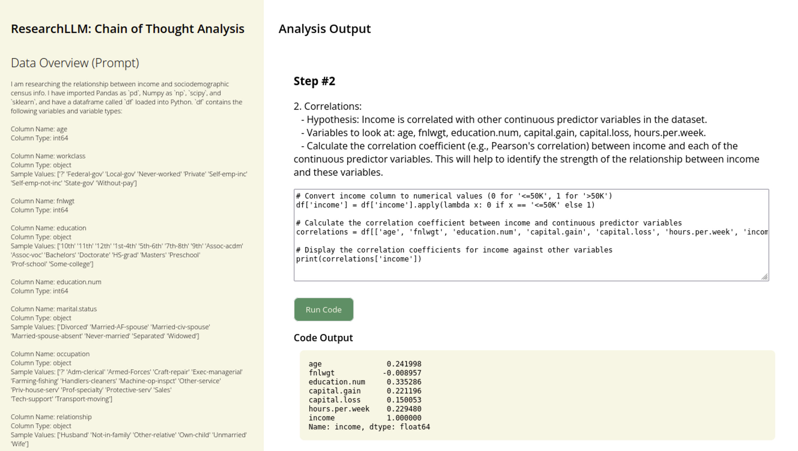

# Chain of Thought (COT) Analytics -- Frontend Version

This is still a work in progress. We need to figure out how to improve the code quality and make it consistent across each step.

## Running

See installation instructions in `cot-analytics`. All the same warnings apply as `researchllm`. Run from this folder with...
```python
from frontend import *
run()
```

## Examples of how this works

The screenshot below shows the first code block being executed. There are no outputs (or errors!) because the code works.


Correlation matrix generated via GPT-4 coding.


## Issues

The `cot-analytics` folder generates a great research plan, but the code isn't consisten across steps. Some thinking below.

### How to fix the code generator...

1. Provide DF printout every time.
2. Run the code blocks before moving to the next ones.
3. Add line #s.
4. Plugin for Jupyter.

Note that this is where logging and evaluation become critical.

### Want to help?

Email me: w (at) phaseai (dot) com
