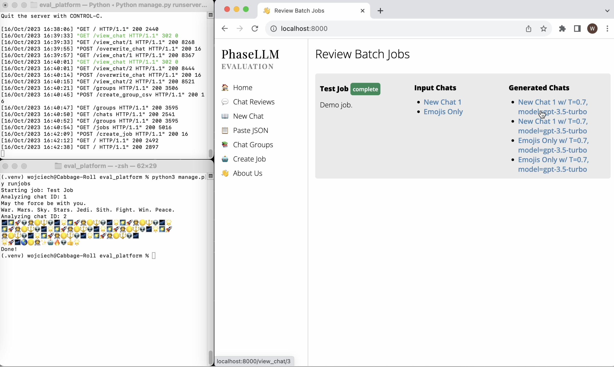

# PhaseLLM Evaluation

*PhaseLLM Evaluation* helps you run batch jobs across LLMs. Think of it as a playground where you can easily run multiple LLM calls across different models.

Example use cases:
- Run the same set of messages `n` times to see how responses differ.
- Run messages across different models (e.g., GPT-4 and GPT-3.5) to see performance differences.
- Replace or update system prompts across multiple chats to see if they have an impact on responses.

[5-minute demo below:](https://www.youtube.com/watch?v=Ycu2eKkCO7Y)
[](https://www.youtube.com/watch?v=Ycu2eKkCO7Y)

## Installation and Running

Please follow the step below to run *PhaseLLM Evaluation*.

Run the code below in the `eval_platform` directory.

```bash
pip3 install -r requirements.txt
python3 manage.py migrate
```

The code above will install `phasellm` and `Django`, and set up the relevant SQLite database.

Update the `env_template.txt` file with your OpenAI API key and save it to `.env`.

Finally, to run the server, type the following:
```bash
python3 manage.py runserver
```

You'll then be able to navigate to `http://localhost:8000` and run your evaluations.

## Running Batch Jobs

Once you've created the proper chats, chat groups, and jobs, open a second terminal window and type the following in your `eval_platform` directory:

```bash
python3 manage.py runjobs
```

This is a custom Django job that will run your jobs. The outputs will be printed in the terminal, btu will also be saved in the front-end.

## Hosting

Want us to host the *Evaluation* demo product for you? Please reach out to us at w [at] phaseai [dot] com

## Feedback?

Any feedback is welcome. Please reach out to w [at] phaseai [dot] com and we'll get back to you as soon as we can!
