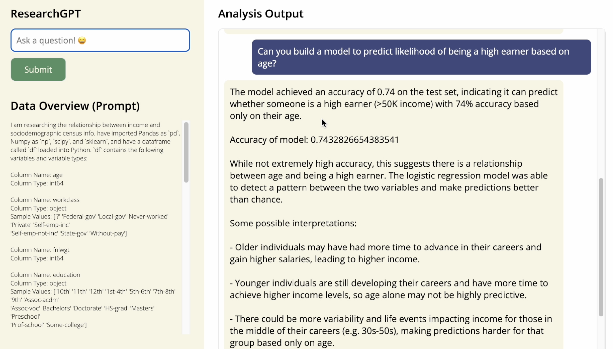

# ResearchGPT

An autonomous statistics helper that converts your natural language queries about a data set to insights.

- Converts natural language questions to Python code
- Runs code locally without sharing data with third parties (just shares metadata)
- Interpets results
- Provide access to underlying Python code for audit and review

[2-minute demo below:](https://www.youtube.com/watch?v=-fzFCii6UoA)
[](https://www.youtube.com/watch?v=-fzFCii6UoA)

## 🚨🚨 WARNING: Runs LLM-Generated Python Code

This product will run LLM-generated Python code on your computer/server. We highly recommend sandboxing the code or running this on a server that doesn't contain any sensitive information or processes.

## Installation and Setup

Clone the GitHub repository and navigate to the folder containing this README.md file. Install the relevant packages (including PhaseLLM):

```
pip install -r requirements.txt
```

## Sample Data Files and Credits

The sample data set included in this project and in the demo video is from the 1994 US census. It was put together by Ron Kohavi and is [available on Kaggle](https://www.kaggle.com/datasets/uciml/adult-census-income?select=adult.csv).

The other data set referenced in our code is [also on Kaggle](https://www.kaggle.com/datasets/new-york-city/nypd-motor-vehicle-collisions), focusing on motor vehicle collisions in New York City. We didn't include it in the repository as it's about 500MB in size. It's a good alternative to the census data above because it contains location data (latitude, longitude pairs), leading to some really interesting analysis options.
